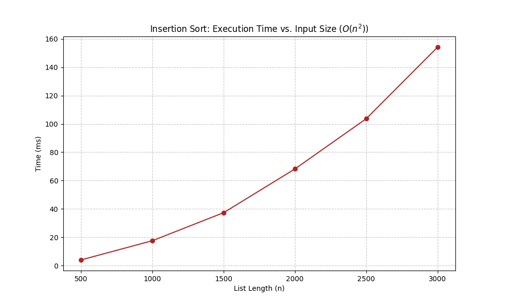

## Insertion Sort Analysis & Benchmarking

This project implements a variation of the Insertion Sort algorithm in Python. It includes a full suite of unit tests
to verify correctness and performance benchmarks to analyze the algorithm's quadratic time complexity.

### Project Structure

```
Insertion_sort/
├── src/
│   └── insertion_sort.py       # Core algorithm logic
├── tests/
│   ├── unit/
│   │   └── test_insertion_sort.py # Functional unit tests
│   └── performance/
│       └── test_performance.py    # Benchmarking & O(n^2) plotting
├── pytest.ini                  # Pytest configuration & markers
└── requirements.txt            # Project dependencies
```

### 🚀 Getting Started

1. Prerequisites: Ensure you have Python 3.8+ installed.
2. Installation: Clone the repository and install the required dependencies (primarily pytest for testing and matplotlib for generating performance graphs):
    ```Bash
    pip install -r requirements.txt
   ```
### 🧪 Running Tests

This project uses pytest markers to separate quick logic checks from heavy performance benchmarks.

**Run Unit Tests (Fast)**
To verify that the sorting logic is correct (handles empty lists, single items, and reverse-sorted data):
```Bash
pytest -m "not performance"
```
**Run Performance Benchmarks (Slow)**
To run the benchmarks, generate the timing data, and view the O(n^2) execution graph:
```Bash
pytest -m performance -s
```
The -s flag is required to see the console output and the interactive graph window.

### 📈 Complexity Analysis

The implementation uses a secondary list and the .insert() method. 
While readable, this results in a Time Complexity of O(n^2).



As shown in the generated performance graphs:
Best Case: O(n) (if the list is already sorted, though the current implementation still scans).
Average/Worst Case: O(n^2) (as input size n doubles, execution time t quadruples).

### 🛠 Technologies Used
- Python 3

- Pytest: Testing framework with custom markers.

- Matplotlib: Data visualization for performance results.


