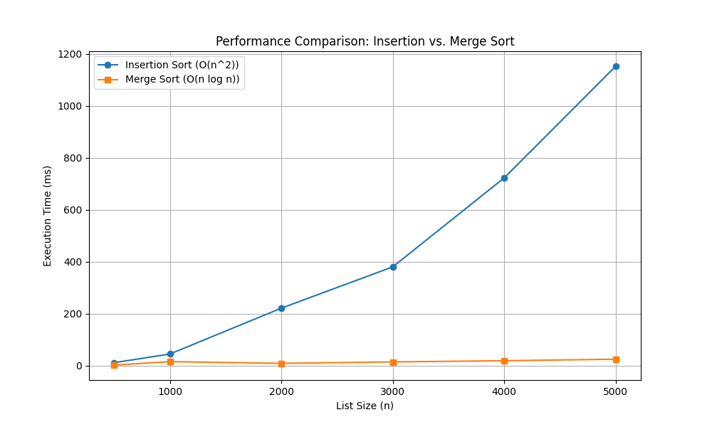
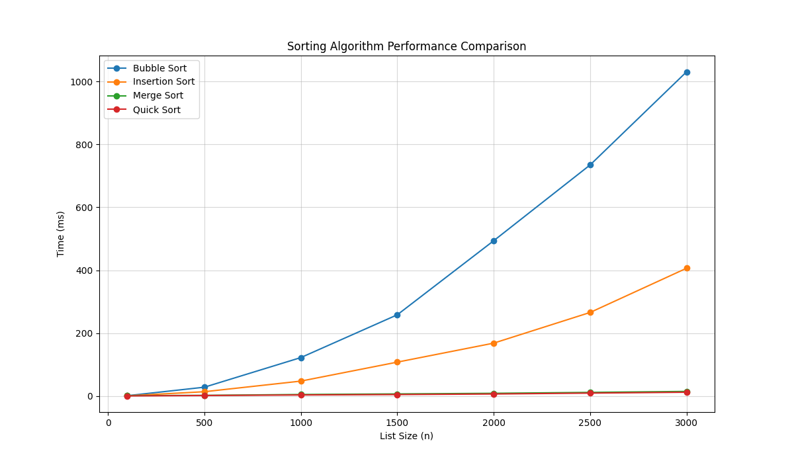

## Merge Sort and ALL sorts Analysis & Comparison
This project implements the Merge Sort algorithm, a highly efficient 
"Divide and Conquer" sorting method. It includes unit tests for correctness 
and performance benchmarks to verify its O(n \log n) time complexity. It also includes 
bubble and quick sort algorithms, measures and compares their performance with other 
sorting algorithms.

### 🧠 How it Works

Merge Sort works by recursively splitting a list into halves until 
each sub-list contains only one element. It then merges those sub-lists 
back together in a sorted manner.
1. Divide: Split the n elements into two halves of n/2.
2. Conquer: Sort the two halves recursively using merge sort.
3. Combine: Merge the two sorted halves into a single sorted list.

### Project Structure
```
Merge_sort/
├── src/
│   ├── __init__.py
│   └── bubble_sort.py          # Core recursive algorithms
│   └── insertion_sort.py
│   └── merge_sort.py
│   └── quick_sort.py
├── tests/
│   ├── unit/
│   │   └── test_merge_sort.py  # Functional & edge case tests
│   └── performance/
│       ├── test_merge_performance.py     # Benchmarking & plotting
│       └── test_performance_all_sorts.py
│       └── all_sorts_comparison.png      # all sorts comparison graph
│       └── comparison_graph.png          # merge and insertion sort comparison
├── requirements.txt               # Dependencies (pytest, matplotlib)
└── README.md
```

### 🚀 Getting Started
**1. Installation**
```bash
pip install -r requirements.txt
```
**2. Running Unit Tests**
```bash
pytest tests/unit/test_merge_sort.py
```
**3. Running Performance Tests**
```bash
pytest tests/performance/test_performance.py -s
```

### 📈 Complexity Analysis

| Algorithm      | Space Complexity | Best case  | Average Case | Worst Case |
|:---------------|:-----------------|:-----------|:-------------|:---------------|
| Insertion Sort | O(1)             | O(n)       | O(n^2)       | O(n^2)    |
| Merge Sort     | O(n)             | O(n log n) | O(n log n)   | O(n log n)   |  
| Bubble Sort    | O(1)             | O(n)       | O(n^2)       | O(n^2)    |
| Quick Sort     | O(n log n)       | O(n log n) | O(n log n)   | O(n^2)    |
### 🖼️ Results
The following graph demonstrates the efficiency of the algorithm as the input size n increases:
Growth pattern is Quadratic for Insertion sort and Linear logarithmic for merge sort

